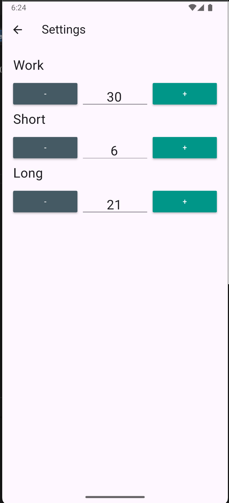

# Timer Break

Timer Break est un side project personnel développé pour expérimenter et approfondir l'utilisation des Streams en Flutter.
L'objectif principal était de mettre en pratique la gestion d'un flux de données en temps réel pour piloter un système de minuterie (start, pause, reset) avec une architecture propre et réactive.

Ce projet m'a permis de travailler sur :

- La gestion d'état basée sur les Streams
- La gestion du cycle de vie des subscriptions

Un projet technique orienté apprentissage, axé sur la maîtrise des mécanismes réactifs dans Flutter.

Screenshots: Illustrant son fonctionnement et son interface : 

TIMER SCREEN

SETTING SCREEN

